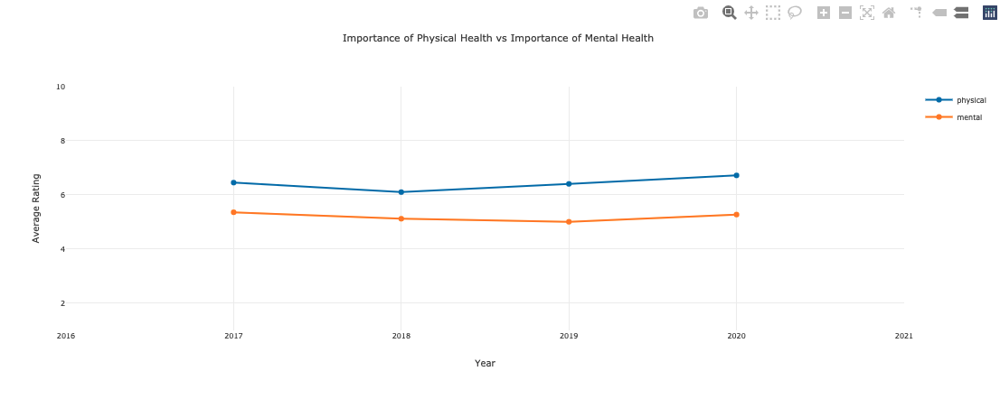
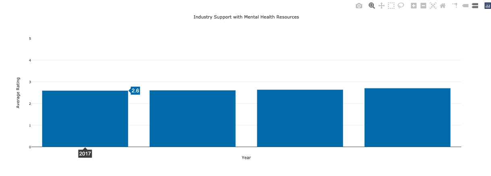
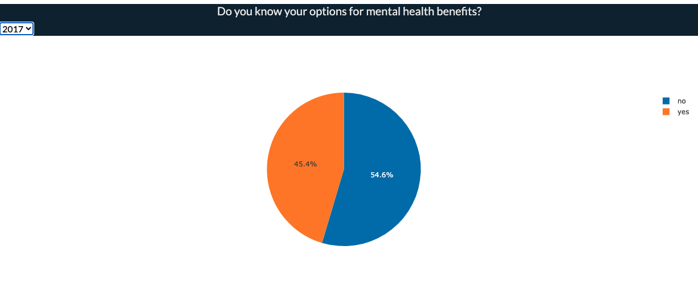

# Mental Health in the Tech Industry

Mental health and conversations surrounding it have come increasingly to the forefront of society as we have navigated through the pandemic. We were curious to take a deeper look at mental health data and uncover underlying trends.

### Visualization 1: How much importance do employers base on employees' physical health vs. mental health?

### Visualization 2: How well does the tech industry support mental health issues?

### Visualization 3: Do you know your options for mental health benefits?

*Note* There is a dropdown option for this visualization for each year of survey data (2017-2020)

